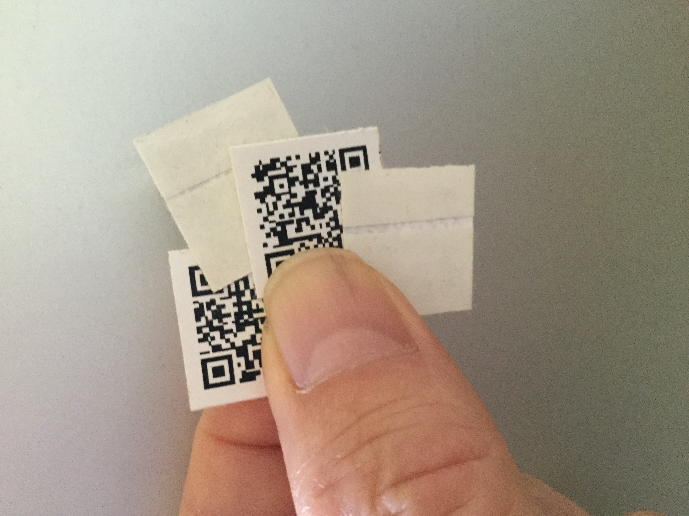
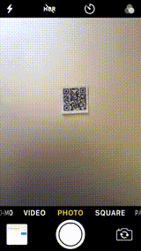
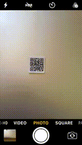


<h1 class="m-5 display-1" style="font-family: 'Parisienne'">Magic Label™</h1>
<a class="btn btn-lg btn-primary me-3 mb-4" href="https://payhip.com/b/bj4t2">
  Store <i class="fa-solid fa-store ms-2"></i>
</a>
<a class="btn btn-lg btn-secondary me-3 mb-4" href="https://ml.uedasoft.com/demo">
  Online Trial<i class="fa-solid fa-chalkboard-user ms-2 "></i>
</a>

The innovative <b>pre-printed QR code sticker which you can set a URL for reading as you like</b> with your mobile! It's like magic, so it's named <i>Magic Label™</i>.




{}
## Have you ever wanted to add a QR code to already printed materials?


{}

{}
Have you ever wanted to add a QR code on printed materials, posters, handwritten notes, etc.? Maybe you have. Then you may have given up because you're too lazy to do the hassle of creating a QR code on your computer, printing it out, cutting it to the appropriate size, and pasting it.

<b>Magic Label™</b>, the innovative pre-printed QR code sticker, is the solution for you! Just read it with your mobile, and then you see a website that sets a website to read. After you set up a website on it, anyone read the website you set as same as a regular QR code. With <i>Magic Label™</i> all your hassles are gone!
{}

{}
# What is the Magic Label™ like?

{}

{}
{}
It looks like a normal 2cm x 2cm QR code sticker. You can peel off its release liner and stick its adhesive face of it anywhere.

What happens when you read the QR code printed on its surface?

{}
{}
When you read the QR code printed on its surface, a web page asking you to enter the URL will open.

What happens when you input a URL, click the REGISTER button, and read it again?

{}
{}
After registering, when you read it, after notification to redirect to the registered URL, it opens the website registered as like as a regular QR code.

Of course, the same site will open no matter who reads it on any device.
{}
{}

{}
## How can I get the Magic Label™?

{}

{}
{}
  You can buy it at the [Atelier UEDA store on the Payhip](https://payhip.com/b/bj4t2).
{}

{}
  You can also purchase from [stripe](https://buy.stripe.com/3cs8yB0Y89pIdsA147).
{}

{}
Shipping will be made by post from Japan. The number of days required for arrival varies depending on the country. Some countries do not have air links to Japan, so shipping is by sea and may take several weeks.

We charge a <b>$1 shipping fee</b> for <b>each order</b>. Free shipping on orders of 10 or more for shipping to select countries.
{}
{}
