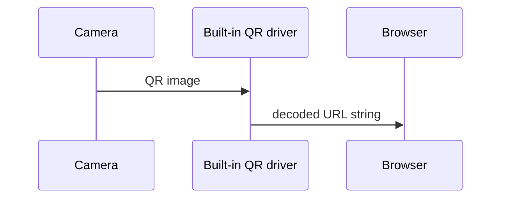

{}
This is a placeholder page that shows you how to use this template site.
{}

## How does the Magic Label™ works.
Regarding regular QR codes, first, there is a URL for associating with it, and the QR code is created based on that. first, there is a URL for associating with it, and the QR code is created based on that. Conversely, regarding the  Magic Label™, first, there is a printed QR code, and you can associate any URL you like with that. Below, I will explain how this is possible by contrasting it with a general QR code.

### How ordinary QR code works.
In principle, a QR code is a geometric representation of **a string of characters**. There is a one-to-one correspondence between characters string and QR code graphic patterns.  

Any smart device like your Smartphone has a built-in QR code driver that reads a QR code image from a built-in camera, decodes it into its original string, and opens it by the built-in web browser in case the string is recognizable as a URL.  



Since the relation between a QR code and a string is one-to-one, it's impossible to change the URL string freely after printing.

### Why does the Magic Label™ set a URL string after printing?
The Magic Label™ also uses the same mechanism to associate with the URL of the ready-made **web application**, which has a DB whose primary key is the ``label ID``.


```plantuml
participant "your mobile" as App
participant "Web Server" as Web
database DB as DB

App -> Web : Label ID
Web -> DB  : Label ID

alt URL is registered
  DB -->> Web : URL
  Web -->> App : App to read URL
else 
  DB -->> Web : No URL message
  Web -->> App : App to set URL
end
```

For many projects, users may not need much information beyond the information in the [Overview](/docs/overview/), so this section is **optional**. However if there are areas where your users will need a more detailed understanding of a given term or feature in order to do anything useful with your project (or to not make mistakes when using it) put that information in this section. For example, you may want to add some conceptual pages if you have a large project with many components and a complex architecture.

Remember to focus on what the user needs to know, not just what you think is interesting about your project! If they don’t need to understand your original design decisions to use or contribute to the project, don’t put them in, or include your design docs in your repo and link to them. Similarly, most users will probably need to know more about how features work when in use rather than how they are implemented. Consider a separate architecture page for more detailed implementation and system design information that potential project contributors can consult.
