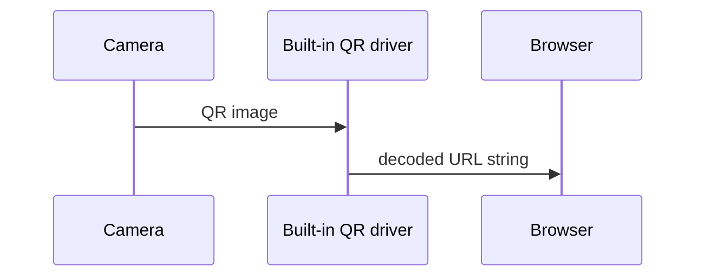

{}
Once you understand how it works, you'll realize that  Magic Labels™ dosn't work by magic, but by a web application running in the background.
{}

## How does the Magic Label™ works.
Regarding regular QR codes, first, there is a URL for associating with it, and the QR code is created based on that. first, there is a URL for associating with it, and the QR code is created based on that. Conversely, regarding the  Magic Label™, first, there is a printed QR code, and you can associate any URL you like with that. Below, I will explain how this is possible by contrasting it with a general QR code.

### How ordinary QR code works.
In principle, a QR code is a geometric representation of **a string of characters**. There is a one-to-one correspondence between characters string and QR code graphic patterns.  

Any smart device like your Smartphone has a built-in QR code driver that reads a QR code image from a built-in camera, decodes it into its original string, and opens it by the built-in web browser in case the string is recognizable as a URL.  



Since the relation between a QR code and a string is one-to-one, it's impossible to change the URL string freely after printing.

### Why does the Magic Label™ set a URL string after printing?
The Magic Label™ also uses the above-mentioned mechanism to associate its pre-printed QR code with the URL to the **ready-made** web application that has a DB whose primary key is the ``label ID``.  

The URL of the QR code printed on a Magic Label™ consists of the ``URL`` web application mentioned above with the unique ``label ID`` as a parameter.

The web application receives the ``label ID`` mentioned above as a parameter and searches the database with it to see if the URL is already registered.  

In case registered, the web application returns the response that asks your mobile to read the URL.  
Contrary to not registered, the web application returns the response that asks you to enter a URL to register.

```plantuml
participant "Your Mobile" as App
participant "Web Application" as Web
database DB as DB

App -> Web : Label ID
Web -> DB  : Label ID

alt URL is registered
  DB -->> Web : URL registered
  Web -->> App : Ask your mobile to read URL
else 
  DB -->> Web : URL NOT registered
  Web -->> App : Ask you to set URL
end
```

## Patented by the Japan Patent Office
The feature mentioned above is patented by the **Japna Patent Office** as follow:
- [P6078766](https://www.j-platpat.inpit.go.jp/c1800/PU/JP-6078766/D2E867CCAFF6CE9635CD4F2A6B6FDBF890F40D6422306B6567C7FBD559EA1CE1/15/ja)